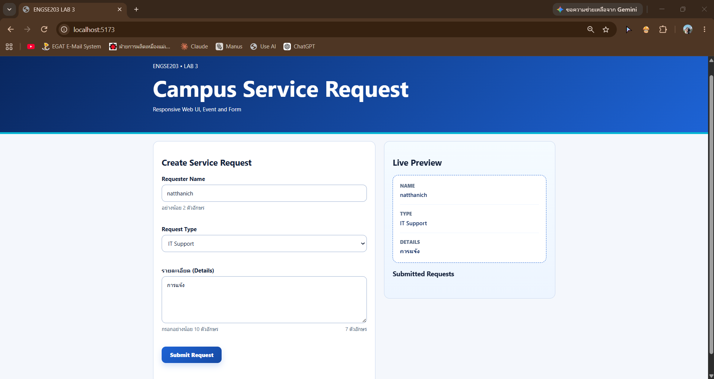
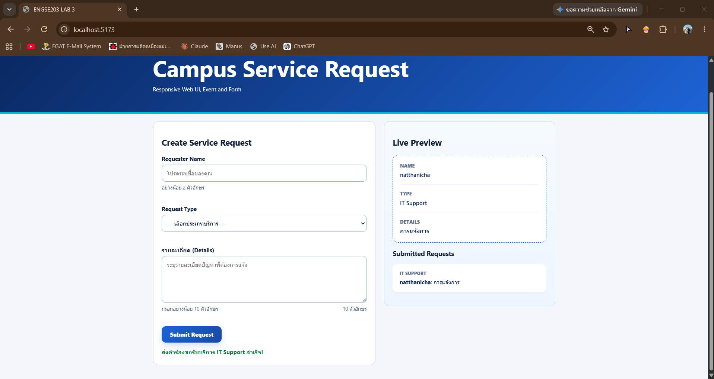

# ENGSE203 LAB 3 — Starter

ทำตามใบงาน `ENGSE203_LAB03_Web_UI_Responsive_Form_ฉบับขยาย_v2.docx`

## Student Information

- Student ID: 68543210063-2
- Name: ณัฐณิชา ปกแก้ว
- Operating system: macOS / Windows + WSL
- GitHub Pages URL: https://github.com/1Poirot/engse203-lab02-68543210063-2

##  วัตถุประสงค์ของงาน (Project Objectives)

- เพื่อฝึกฝนกระบวนการทำงานและเครื่องมือมาตรฐานในการพัฒนาเว็บ
- เพื่อประยุกต์ใช้ HTML, CSS และ JavaScript ในการออกแบบ Web UI
- เพื่อเรียนรู้การออกแบบหน้าเว็บแบบ Responsive Design
- เพื่อฝึกการสร้างและจัดการ Form รวมถึงการตรวจสอบข้อมูล


## Installation and Run

```bash
npm install
npm run check
npm run dev
```

## Build and Preview

```bash
npm run build
npm run preview
```

## โครงสร้าง

```text
engse203-lab03-68543210063-2/
├── docs/
├── image/
│    └──image/image-1.png
│    └──image/image.png
├──node_modules
├── public/
├── src/
│   ├── main.js
│   └── style.css
├── .gitignore
├── index.html
├── package-lock.json
├── package.json
├── README.md
└── vite.config.js
```

## Test Evidence

- Normal state screenshot: 
- Error state screenshot 


## References & AI Assistance

- References used: `<list sources>`
- AI assistance used: `<describe question asked and what you changed/understood yourself>`