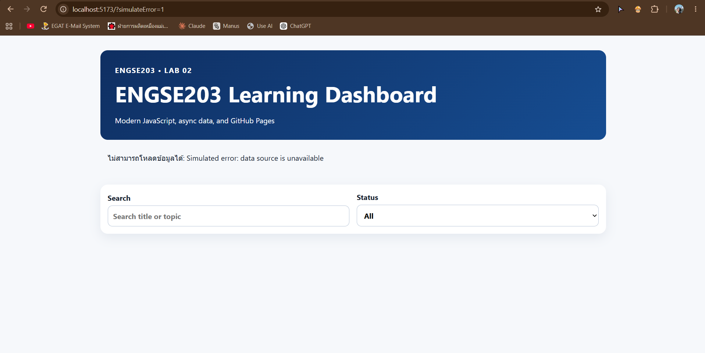
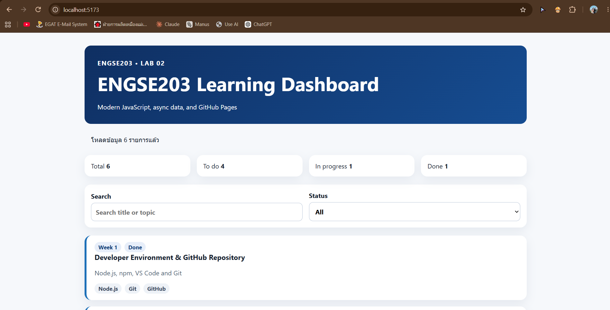

# ENGSE203 Learning Dashboard

> LAB 02 — Modern JavaScript, Modules & Async Data

## Student Information

- Student ID: 68543210063-2
- Name: ณัฐณิชา ปกแก้ว
- Operating system: macOS / Windows + WSL
- GitHub Pages URL: https://github.com/1Poirot/engse203-lab02-68543210063-2

##  วัตถุประสงค์ของงาน (Project Objectives)

* เพื่อฝึกฝนกระบวนการทำงานและการใช้เครื่องมือมาตรฐานในการพัฒนาเว็บแอปพลิเคชัน
* เพื่อประยุกต์ใช้ไวยากรณ์ JavaScript สมัยใหม่ (Modern JavaScript) ในการพัฒนาโปรแกรม
* เพื่อเรียนรู้การออกแบบและจัดโครงสร้างโปรแกรมให้สามารถแบ่งส่วนของโค้ดได้อย่างเป็นระบบ
* เพื่อพัฒนาทักษะการจัดการข้อผิดพลาดและสถานะของระบบในการพัฒนาเว็บ


## Installation and Run

```bash
npm install
npm run check
npm run dev
```

## Build and Preview

```bash
npm run build
npm run preview
```

## โครงสร้าง

```text
engse203-lab03-68543210063-2/
├── docs/
├── image/
│    └──image/image-1.png
│    └──image/image.png
├──node_modules
├── public/
│   └── data/
│       └── learning-tasks.json
├── scripts/
├── src/
│   ├── api.js
│   ├── main.js
│   ├── style.css
│   ├── ui.js
│   └── utils.js
├── docs/      
├── .gitignore
├── index.html
├── package.json
├── README.md
└── vite.config.js
```

## Test Evidence

- Normal state screenshot: 
- Error state screenshot 


## References & AI Assistance

- References used: `<list sources>`
- AI assistance used: `<describe question asked and what you changed/understood yourself>`
